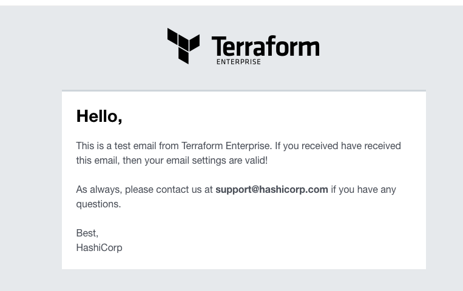

# tfe_aws_smtp
TFE on AWS with smtp enablement

Setting up TFE that is able to send emails. 

Started by trying to use AWS SES (Simple Email Service). This didn't work for me because I need to create SMTP credentials and my AWS account doesn't allow me to create a user with SMTP credentials. 

Looked for another SMTP mail server. Went for [mailtrap.io](mailtrap.io). You can create a free account and this will allow you to send emails and review them online. 

This resulted in the manual test with a successful email  
  

# Diagram

  

# TODO
- [] Create an AWS RDS PostgreSQL
- [] create a virtual machine in a public network with public IP address.
    - [] use standard ubuntu 
    - [] firewall inbound are all from user building external ip
    - [] firewall outbound rules
          postgresql rds
          AWS bucket          
- [] Create an AWS bucket
- [] create an elastic IP to attach to the instance
- [] transfer files to TFE virtual machine
      - license
      - TLS certificates
- [] Create a valid certificate to use 
- [] point dns name to public ip address
- [] build network according to the diagram
- [] test it manually
- [] install TFE
- [] Use and configure Simple Email Service

# DONE
- [x] Creating a diagram of what to build
