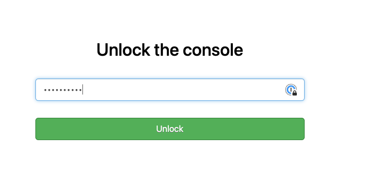
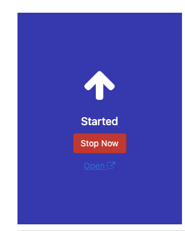
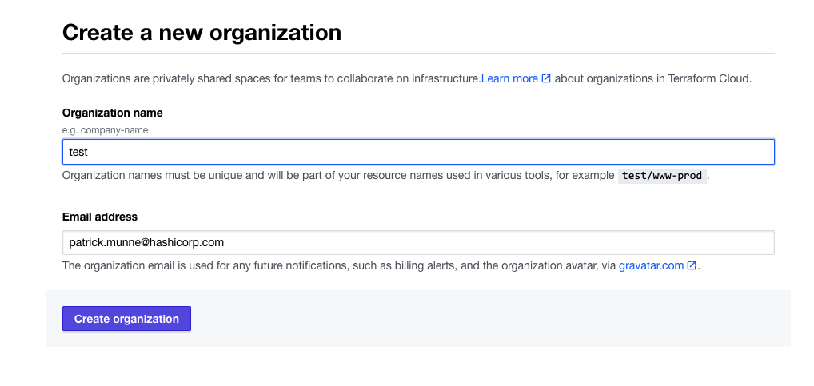

# Terraform Enterprise installation with SMTP enabled

With this repository you will be able to do a TFE (Terraform Enterprise) installation on AWS with external services for storage in the form of S3 and PostgreSQL. It will guide you through the steps of configuring SMTP service for TFE to send mail to you users. 

The email service in this example will use [mailtrap.io](https://mailtrap.io). You can create a free account on there website and with that you get a SMTP server to which you can send and receive mail from any sender to any receiver. It will stay within mailtrap.io and never go to the outside world. 

The Terraform code will do the following steps

- Create S3 buckets used for TFE
- Upload the necessary software/files for the TFE installation to an S3 bucket
- Generate TLS certificates with Let's Encrypt to be used by TFE
- Create a VPC network with subnets, security groups, internet gateway
- Create a RDS PostgreSQL to be used by TFE
- Create an EC2 instance which will do a TFE instance installation

# Diagram

  

# Prerequisites

## License
Make sure you have a TFE license available for use

Store this under the directory `airgap/license.rli`

## Airgap software
Download the `.airgap` file using the information given to you in your setup email and place that file under the directory `./airgap`

Store this for example under the directory `airgap/610.airgap`

## Installer Bootstrap
[Download the installer bootstrapper](https://install.terraform.io/airgap/latest.tar.gz)

Store this under the directory `airgap/replicated.tar.gz`

## AWS
We will be using AWS. Make sure you have the following
- AWS account  
- Install AWS cli [See documentation](https://docs.aws.amazon.com/cli/latest/userguide/install-cliv2.html)

## Install terraform  
See the following documentation [How to install Terraform](https://learn.hashicorp.com/tutorials/terraform/install-cli)

## TLS certificate
You need to have valid TLS certificates that can be used with the DNS name you will be using to contact the TFE instance.  
  
The repo assumes you have no certificates and want to create them using Let's Encrypt and that your DNS domain is managed under AWS. 

# How to

Looked for another SMTP mail server. Went for [mailtrap.io](mailtrap.io). You can create a free account and this will allow you to send emails and review them online. 

This resulted in the manual test with a successful email  
  

manual setup details:[here](manual_setup/README.md)  

# Diagram

  

# Create Terraform organization

- login to the TFE dashboard  
    
- Go to the TFE application to create a first admin user
    
- create a new organization  
     
- 

# TODO
- [] Use and configure Simple Email Service

# DONE
- [x] Creating a diagram of what to build
- [x] Create an AWS RDS PostgreSQL
- [x] create a virtual machine in a public network with public IP address.
    - [x] use standard ubuntu 
    - [x] firewall inbound are all from user building external ip
    - [x] firewall outbound rules
          postgresql rds
          AWS bucket          
- [x] Create an AWS bucket
- [x] create an elastic IP to attach to the instance
- [x] transfer files to TFE virtual machine
      - license
      - TLS certificates
- [x] Create a valid certificate to use 
- [x] point dns name to public ip address
- [x] build network according to the diagram
- [x] test it manually
- [x] install TFE
