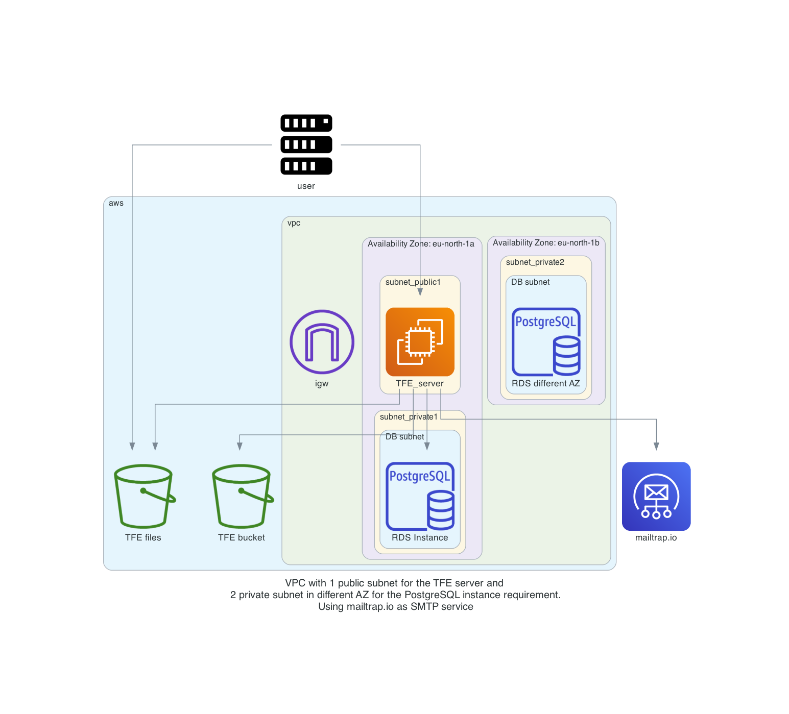

# tfe_aws_smtp
TFE on AWS with smtp enablement

# Diagram

  

# TODO
- [] Create an AWS RDS PostgreSQL
- [] create a virtual machine in a public network with public IP address.
    - [] use standard ubuntu 
    - [] firewall inbound are all from user building external ip
    - [] firewall outbound rules
          postgresql rds
          AWS bucket          
- [] Create an AWS bucket
- [] create an elastic IP to attach to the instance
- [] transfer files to TFE virtual machine
      - license
      - TLS certificates
- [] Create a valid certificate to use 
- [] point dns name to public ip address
- [] build network according to the diagram
- [] test it manually
- [] install TFE
- [] Use and configure Simple Email Service

# DONE
- [x] Creating a diagram of what to build
