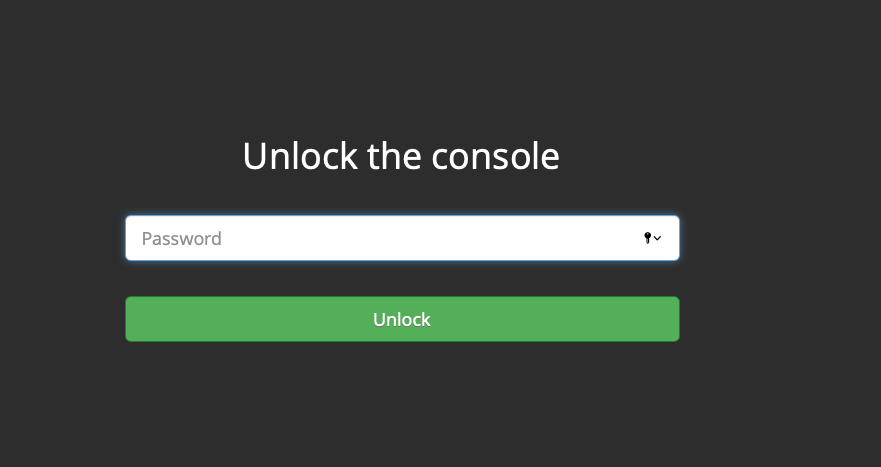
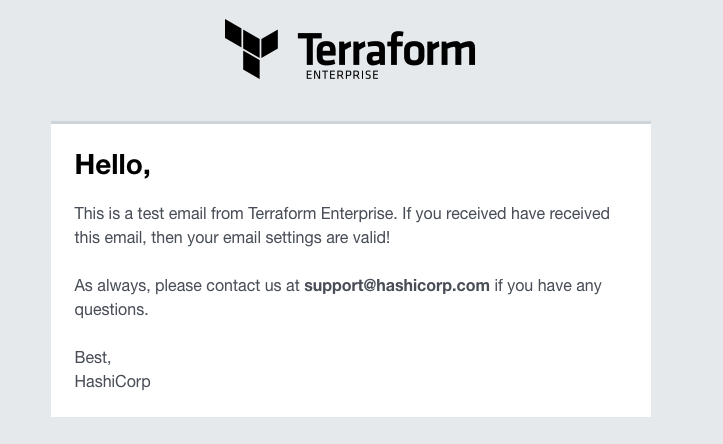

# Terraform Enterprise installation with SMTP enabled

With this repository you will be able to do a TFE (Terraform Enterprise) installation on AWS with external services for storage in the form of S3 and PostgreSQL. It will guide you through the steps of configuring SMTP service for TFE to send mail to you users. 

The email service in this example will use [mailtrap.io](https://mailtrap.io). You can create a free account on there website and with that you get a SMTP server to which you can send and receive mail from any sender to any receiver. It will stay within mailtrap.io and never go to the outside world. 

The Terraform code will do the following steps

- Create S3 buckets used for TFE
- Upload the necessary software/files for the TFE installation to an S3 bucket
- Generate TLS certificates with Let's Encrypt to be used by TFE
- Create a VPC network with subnets, security groups, internet gateway
- Create a RDS PostgreSQL to be used by TFE
- Create an EC2 instance which will do a TFE instance installation

# Diagram

  

# Prerequisites

## License
Make sure you have a TFE license available for use

Store this under the directory `files/license.rli`

## Mailtrap.io
Make sure you have a free account on [mailtrap.io](https://mailtrap.io) and you get the specifics of the SMTP settings from your mailtrap.io mailbox.   

Example:    
    

## AWS
We will be using AWS. Make sure you have the following
- AWS account  
- Install AWS cli [See documentation](https://docs.aws.amazon.com/cli/latest/userguide/install-cliv2.html)

## Install terraform  
See the following documentation [How to install Terraform](https://learn.hashicorp.com/tutorials/terraform/install-cli)

## TLS certificate
You need to have valid TLS certificates that can be used with the DNS name you will be using to contact the TFE instance.  
  
The repo assumes you have no certificates and want to create them using Let's Encrypt and that your DNS domain is managed under AWS. 

# How to

- Clone the repository to your local machine
```sh
git clone https://github.com/munnep/tfe_aws_smtp.git
```
- Go to the directory
```sh
cd tfe_aws_smtp
```
- Set your AWS credentials
```sh
export AWS_ACCESS_KEY_ID=
export AWS_SECRET_ACCESS_KEY=
export AWS_SESSION_TOKEN=
```
- Store the files needed for the TFE Airgap installation under the `./airgap` directory, See the notes [here](./airgap/README.md)
- create a file called `variables.auto.tfvars` with the following contents and your own values
```hcl
tag_prefix               = "patrick-tfe7"                             # TAG prefix for names to easily find your AWS resources
region                   = "eu-north-1"                               # Region to create the environment
vpc_cidr                 = "10.234.0.0/16"                            # subnet mask that can be used 
ami                      = "ami-09f0506c9ef0fb473"                    # AMI of the Ubuntu image  
rds_password             = "Password#1"                               # password used for the RDS environment
filename_license         = "license.rli"                              # filename of your TFE license stored under ./airgap
dns_hostname             = "patrick-tfe7"                             # DNS hostname for the TFE
dns_zonename             = "bg.hashicorp-success.com"                 # DNS zone name to be used
tfe_password             = "Password#1"                               # TFE password for the dashboard and encryption of the data
certificate_email        = "patrick.munne@hashicorp.com"              # Your email address used by TLS certificate registration
public_key               = "ssh-rsa AAAAB3Nza"                        # The public key for you to connect to the server over SSH
```
- Terraform initialize
```sh
terraform init
```
- Terraform plan
```sh
terraform plan
```
- Terraform apply
```sh
terraform apply
```
- Terraform output should create 33 resources and show you the public dns string you can use to connect to the TFE instance
```sh
Apply complete! Resources: 33 added, 0 changed, 0 destroyed.

Outputs:

ssh_tfe_server = "ssh ubuntu@patrick-tfe7.bg.hashicorp-success.com"
ssh_tfe_server_ip = "ssh ubuntu@13.51.247.150"
tfe_appplication = "https://patrick-tfe7.bg.hashicorp-success.com"
tfe_dashboard = "https://patrick-tfe7.bg.hashicorp-success.com:8800"
```
- Connect to the TFE dashboard. This could take 5 minutes before fully functioning.  
See the url for tfe_dashboard in your terraform output. 
- Unlock the dashboard with password from your `variables.auto.tfvars`    
    
- Click on the open button to go to the TFE application page    
  
- Create the first account    

- create your organization and workspaces    
  
- Go to the right to your admin page    
   
- Go to the left to you Administration - SMTP   
    
- Configure your SMTP settings and click on save settings     
   
- If you login to [mailtrap.io](https://mailtrap.io) you should see the welcome mail in your mailbox  
    
- When you are done you can destroy the entire environment  
```sh
terraform destroy
```

# TODO

# DONE
- [x] Creating a diagram of what to build
- [x] Create an AWS RDS PostgreSQL
- [x] create a virtual machine in a public network with public IP address.
    - [x] use standard ubuntu 
    - [x] firewall inbound are all from user building external ip
    - [x] firewall outbound rules
          postgresql rds
          AWS bucket          
- [x] Create an AWS bucket
- [x] create an elastic IP to attach to the instance
- [x] transfer files to TFE virtual machine
      - license
      - TLS certificates
- [x] Create a valid certificate to use 
- [x] point dns name to public ip address
- [x] build network according to the diagram
- [x] test it manually
- [x] install TFE
- [x] Use and configure Simple Email Service
