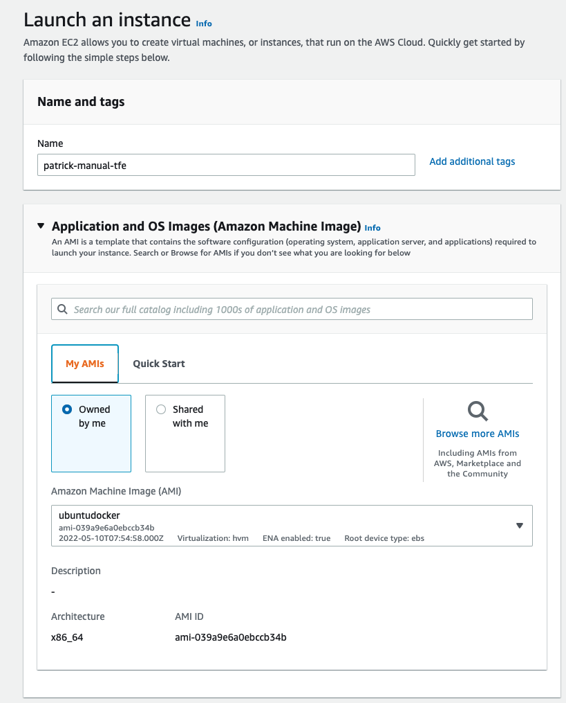

# manual steps for creating a TFE external installation

This document describes the manual steps to install TFE in AWS with a public IP address and an external installation. [here](#mailtrapio) you can find the configuration for smtp on your TFE environment

## Network

We create a network according to the following diagram
  


- Create a VPC with cidr block 10.233.0.0/16  
    
- Create 2 subnets. 1 public subnets and 1 private subnet
patrick-public1-subnet (ip: 10.233.1.0/24 availability zone: eu-north-1a)
patrick-private1-subnet (ip: 10.233.11.0/24 availability zone: eu-north-1a)
patrick-private2-subnet (ip: 10.233.12.0/24 availability zone: eu-north-1b)  
      
   
  
- create an internet gateway  
  
- attach it to the created VPC  
    
- create routing table for public
     
- add the route to the public subnet
    
- Generate a public IP address that we will associate with the TFE instance later.   
  
    

- create a security group that allows 
everything from your own machine   
port 5432 from the internal network   
https from TFE public IP to itself  
    

## create the instance
- create an instance using the ubuntu image with docker installed
using AMI: ami-039a9e6a0ebccb34b
instance type: t3.large
     
      
      
- assign the public ip address to the instance   
    
    


## create the RDS postgresql instance
Creating the RDS postgreSQL instance to use with TFE instance

- PostgreSQL instance version 12    
    
    
    
    
    
    
    
endpoint: patrick-manual-tfe.cvwddldymexr.eu-north-1.rds.amazonaws.com

# AWS to use
- create a bucket patrick-tfe-manual  
  
  
      

aws s3 cp test.txt s3://patrick-tfe-manual/test.txt

- create IAM policy to access the bucket from the created instance
- create a new policy
```
{
    "Version": "2012-10-17",
    "Statement": [
        {
            "Sid": "VisualEditor0",
            "Effect": "Allow",
            "Action": [
                "s3:PutObject",
                "s3:GetObject",
                "s3:ListBucket",
                "s3:DeleteObject",
                "s3:GetBucketLocation"
            ],
            "Resource": [
                "arn:aws:s3:::patrick-tfe-manual",
                "arn:aws:s3:::*/*"
            ]
        },
        {
            "Sid": "VisualEditor1",
            "Effect": "Allow",
            "Action": "s3:ListAllMyBuckets",
            "Resource": "*"
        }
    ]
}
```

- create a new role  
    
    
- attach the role to the instance  
  
    
- you should now be able to upload a file to the s3 bucket
```
ubuntu@ip-10-233-1-81:~$ aws s3 cp test.txt s3://patrick-tfe-manual/test.txt
upload: ./test.txt to s3://patrick-tfe-manual/test.txt
```

## create the certificate TLS to use
dns: patrick-tfe.bg.hashicorp-success.com

used the following manual to create it: https://github.com/munnep/nginx_create_certificates
```
certbot -d patrick-tfe.bg.hashicorp-success.com --manual --preferred-challenges dns certonly
```
files stored under ../certificates/

## DNS pointer
point the DNS record to the public IP address of the instance with route53  
  


## copy installation files
- copy installation files to your ec2 instance
```
scp -r * ubuntu@13.53.254.90:/tmp/

chain.pem                                                                            100% 3750   147.2KB/s   00:00    
cert.pem                                                                             100% 1899    73.2KB/s   00:00    
privkey.pem                                                                          100% 1704    68.4KB/s   00:00    
fullchain.pem                                                                        100% 5649   226.1KB/s   00:00    
license.rli                                                                          100%   14KB 519.3KB/s   00:00    
```

# TFE installer

- start the installer
```
cd /tmp
curl -o install.sh https://install.terraform.io/ptfe/stable
bash ./install.sh no-proxy private-address=10.234.1.22 public-address=13.51.23.34
```
after 2 minutes you should see the following
```

Operator installation successful

To continue the installation, visit the following URL in your browser:

  http://<this_server_address>:8800
```
- Continue to the webbrowser: http://patrick-tfe.bg.hashicorp-success.com:8800/
    
    
    


- Installation settings  
  hostname: patrick-tfe.bg.hashicorp-success.com  
  encryption password:    
  Production type: External Services  
  Postgresql configuration:   
     username: postgres  
     password:  
     hostname and optional port: patrick-manual-tfe.cvwddldymexr.eu-north-1.rds.amazonaws.com  
     database name: tfe  
  object storage:  
     use instance profile for access  
     bucket: patrick-tfe-manual  
     Region: eu-north-1     
     test authentication should succeed      
Save settings  

- open terraform itself  
  
- create username and password  
      
- create an organization  
      
- create a workspace and run some terraform code which should succeed  
    

# mailtrap.io

- Create a free account on [mailtrap.io](mailtrap.io)
- Get the details for SMTP and username/password from mailtrap.io to use in TFE
sandbox --> inboxes --> smtp settings  
    
- Login to Terraform Enterprise 
- Go to the admin page on the right
  
- go to the administration on the left
  
- fill in the information as you got from mailtrap.io
    
- klik on save SMTP settings
- login to mailtrap.io to see if you are able to have the email send


# REMOVE everything

- ec2 instance
- rds instance
- aws s3 bucket
- policie and role
- subnets
- route table
- gateway
- bpc


# done
- [x] Create an AWS image to use with correct disk size and Docker software installed
- [x] build network according to the diagram
- [x] Create an AWS RDS PostgreSQL
- [x] Create an AWS bucket
- [x] Create a valid certificate to use 
- [x] Get an  software download
- [ ] create an elastic IP to attach to the instance
- [x] create a virtual machine in a public network with public IP address.
    - [x] firewall inbound are all from user building external ip
    - [x] firewall outbound rules
          postgresql rds
          AWS bucket
          user building external ip
- [x] transfer files to TFE virtual machine
      -  software
      - license
      - TLS certificates
      - Download the installer bootstrapper
- [x] point dns name to public ip address
- [x] install TFE
- [x] create a TFE user organization and workspace to test the functionality


# To do
